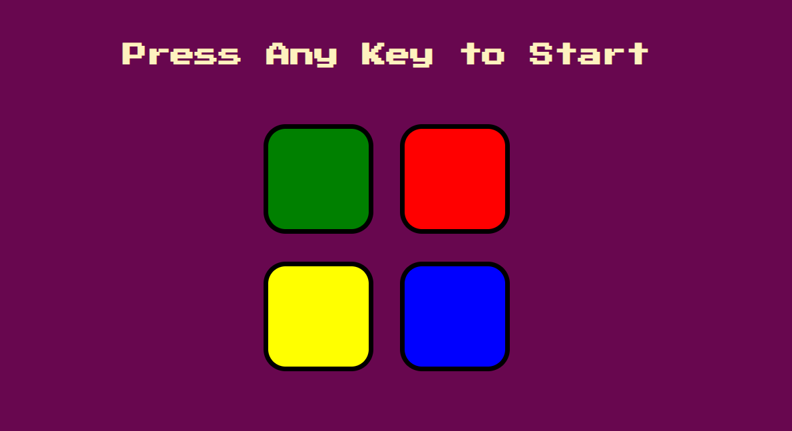
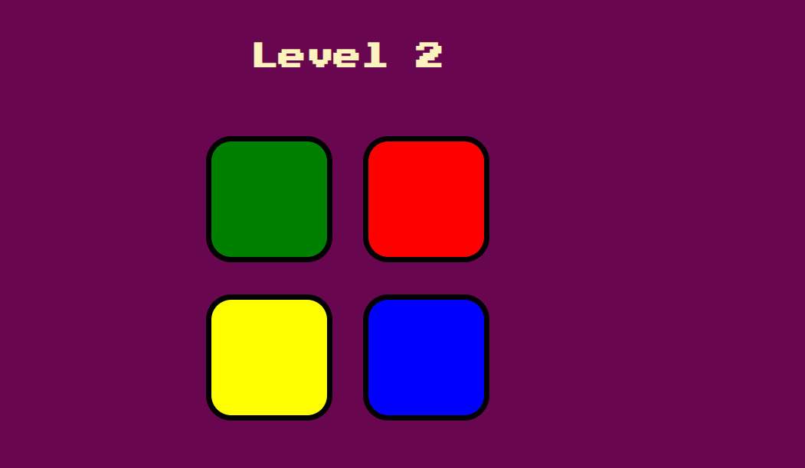
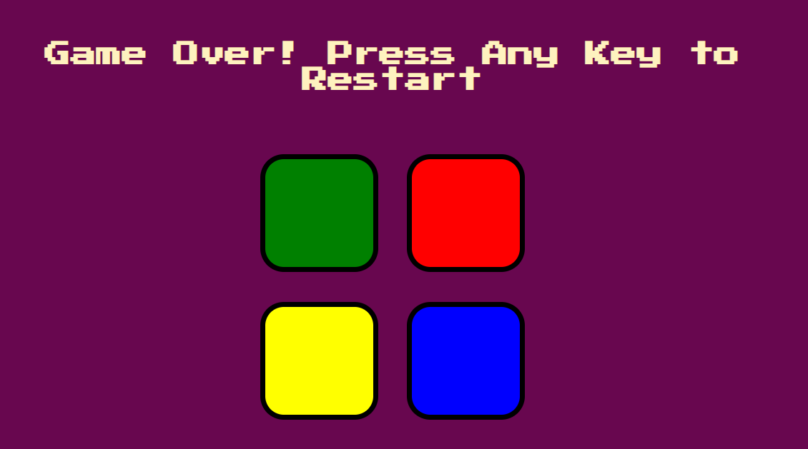

# Memory Game:

This game mimics the famous "Simon Says" game. It is a game that tests the player's memory by glowing a random button, playing a specific sound for each, and requiring the player to repeat this sequence. 
Every time the player repeats the sequence correctly, they pass the level. However, when the player enters the wrong sequence the background flashes red and the player must press any keyboard button to repeat the game. 


# Play on Github Pages: 

Click on [play In Browser](https://majdharbb.github.io/Game/) to play the demo. 

## Languages & Tools Used:
<p align="center">


</p>

## Used Scipts:

This game includes two files JS & JQuery. 
To use the JS file, comment the JQuery script tags: 
```
<!-- <script src="scripts/js_solution.js" type="text/javascript"></script> -->
```
Or use the JQuery file, comment the JavaScript script tags:
```
<!-- <script src="scripts/jquery_solution.js"></script> -->
```

## Images:
Landing Page: the player presses any key to start.

<br/>
Walk through to level 2 if the player correctly mimics the generated sequence. 

<br/>
Game Over: when the player presses the wrong button, now the game restarts on pressing any key.


